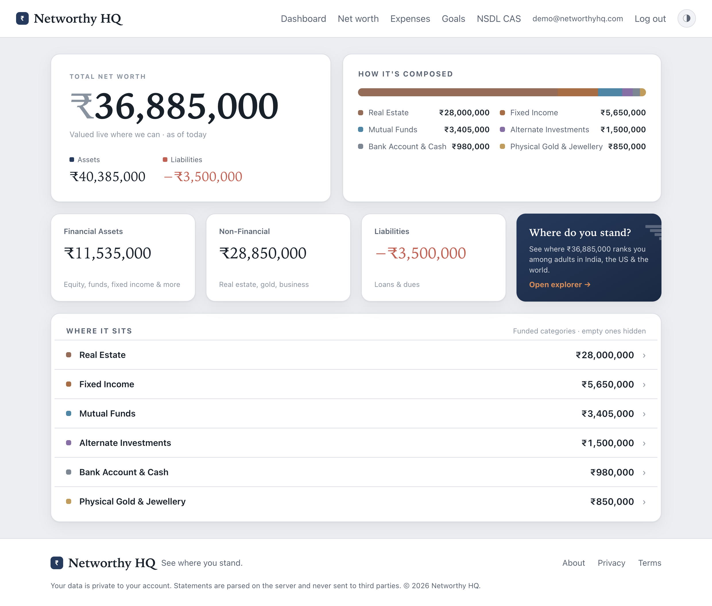
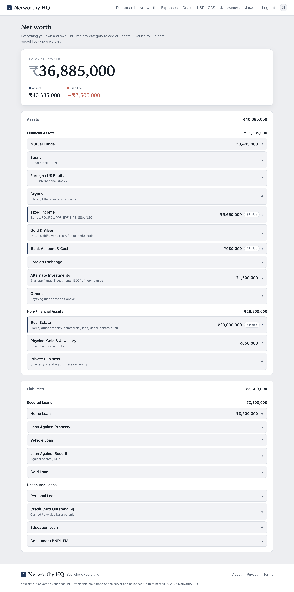
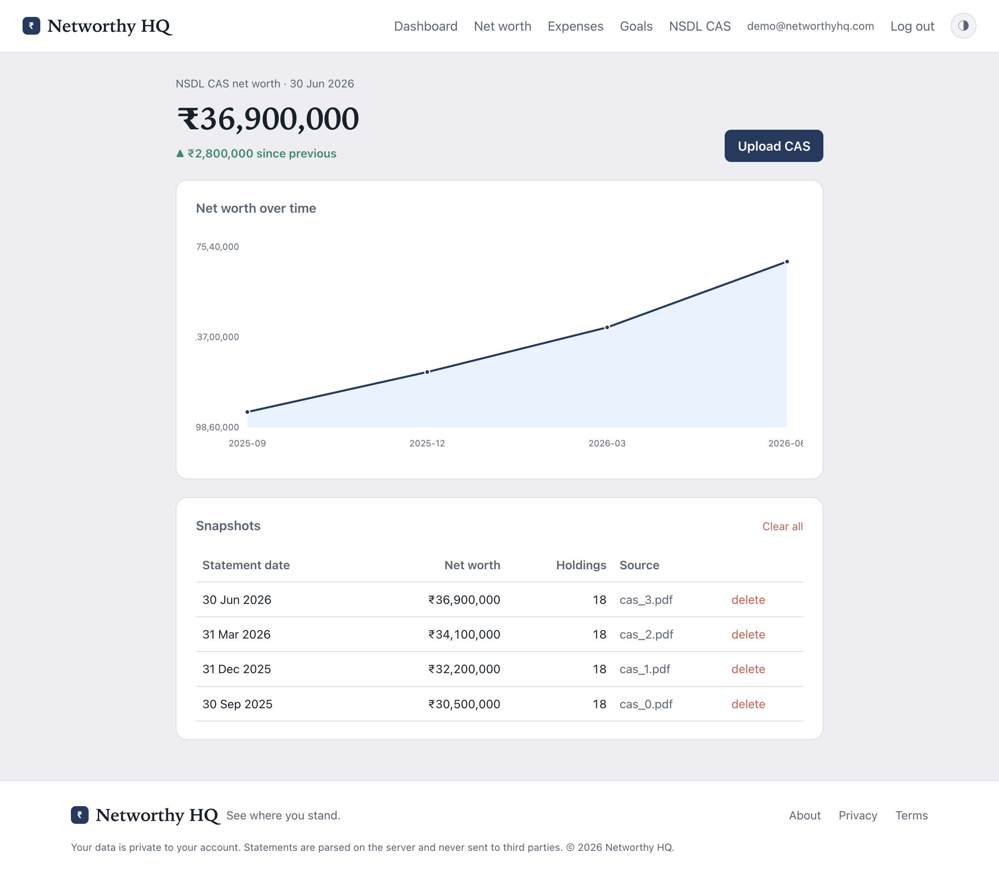
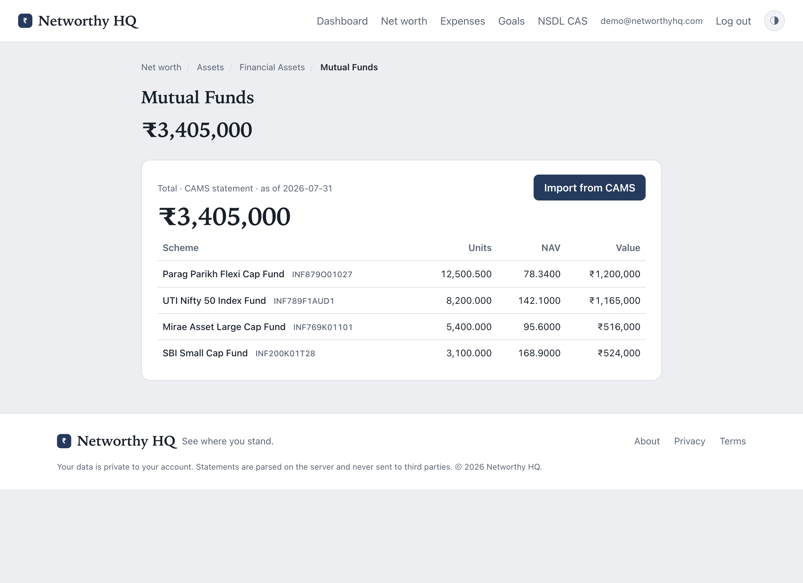
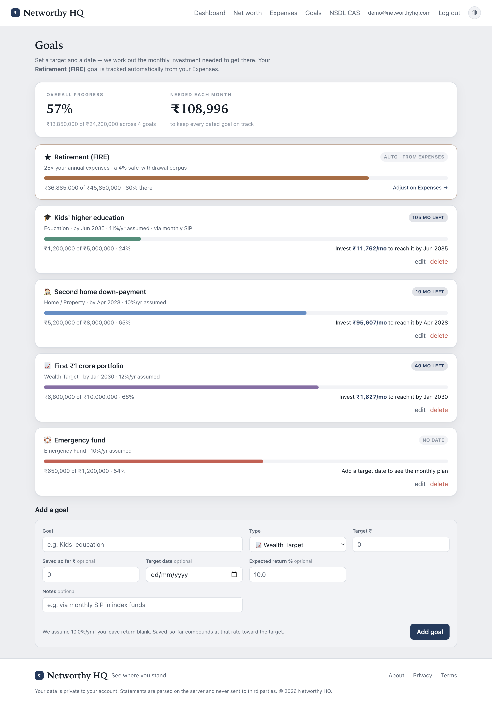
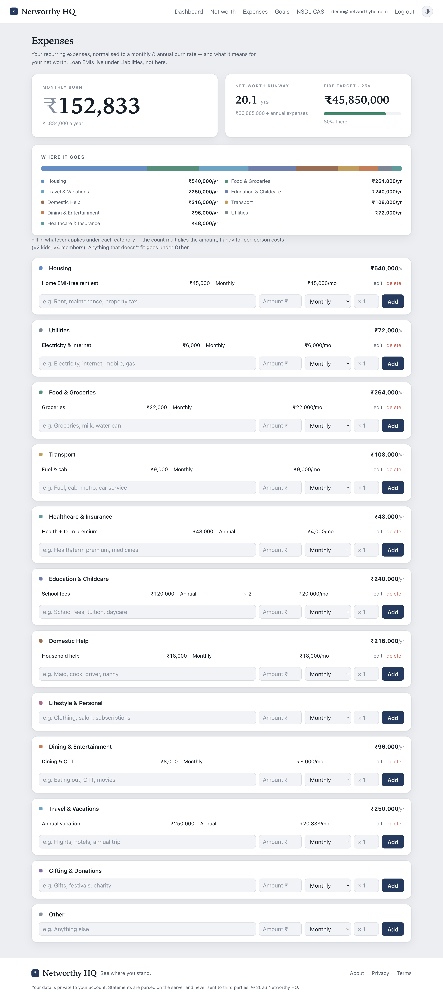

# Networthy HQ

**A private, self-hosted net-worth tracker for Indian investors.** Upload your
**NSDL CAS** and **CAMS/KFintech** statements, add everything else by hand — property,
gold, foreign equity, crypto, bank balances, loans — and see your complete net worth
in one place, priced live where it can be.

> **Privacy is the whole point.** Statements are parsed **on your own server** and the
> parsed database lives under `data/` (gitignored). Nothing about your holdings ever
> leaves the machine — the *only* things that egress are public price lookups by symbol
> (a ticker, a currency pair, a coin), never a value, quantity, PAN, or identity.

**Try it without signing up:** the landing page has an **Explore the live demo** button
(`GET /demo`) that drops you into a fully-loaded demo account — no email required.



---

## What it does

- **Parses password-protected CAS PDFs** — NSDL e-CAS (demat holdings across NSDL +
  CDSL, plus mutual-fund folios) and CAMS/KFintech CAS (all-AMC mutual funds). Decrypt
  → extract → classify by asset class, all locally.
- **A complete Assets & Liabilities tree** — every asset class as a navigable leaf:
  mutual funds, direct & foreign equity, crypto, fixed income (PPF/EPF/FDs/bonds/NPS),
  gold & silver, physical gold, real estate, alternate investments, private business,
  bank & cash, forex — netted against every kind of loan.
- **Live valuation** — equities from Yahoo Finance (by ticker), mutual-fund NAVs from
  AMFI's public bulk feed (looked up locally), USD/FX and crypto and gold priced live,
  all cached and fail-soft so a slow endpoint never breaks a page.
- **Expenses planner** — recurring spend normalised to a monthly/annual burn, with the
  net-worth connection: runway and a FIRE target (25×, the 4% rule).
- **Goals** — target-by-date planning that computes the **monthly SIP** needed to get
  there, plus a read-only Retirement (FIRE) goal mirrored from your expenses.
- **"Where do you stand?"** — rank your net worth among adults in India, the US, and the
  world (computed client-side; nothing you type is sent anywhere).
- **Multi-user** — sign in with email + a one-time code. Each account's data is isolated.
- **Email digests** — an optional daily net-worth pulse and a weekly breakdown.

## Screens

| | |
|---|---|
|  |  |
| **Net worth** — the full Assets/Liabilities tree, values rolled up and priced live. | **NSDL CAS** — net worth over time from each uploaded statement. |
|  |  |
| **A data-backed leaf** — holdings from your CAMS import, live NAVs and values. | **Goals** — target, date, and the monthly SIP to reach it. |
|  | |
| **Expenses** — monthly/annual burn, category breakdown, runway & FIRE. | |

## How it works

```
upload CAS PDF(s)  →  parse (decrypt + extract + classify)  →  SQLite (under data/)
                                                                     │
   manual entries (property, gold, loans, …) ──────────────────────┤
                                                                     ▼
                    live pricing (Yahoo / AMFI, by symbol only)  →  Dashboard · Net worth · Goals
```

1. Download your CAS — NSDL e-CAS from [nsdl.co.in](https://nsdl.co.in), or a CAMS CAS
   from [camsonline.com](https://www.camsonline.com/Investors/Statements/Consolidated-Account-Statement).
   It arrives as a **password-protected PDF** (password is usually your PAN in CAPITALS).
2. Upload it (the app remembers your PAN as the password so you don't retype it).
3. Add anything a statement doesn't cover — property, physical gold, bank balances,
   foreign equity, crypto, loans — by hand.
4. The Dashboard, Net-worth tree, and Goals reflect it all, valued live where possible.

## Tech stack

Server-rendered **FastAPI + Jinja2**, **SQLite** (stdlib `sqlite3`), no frontend
framework and a single hand-written CSS design system ("Ink Navy & Copper", light + dark).
PDF parsing via **pikepdf** (decrypt) + **pdfplumber** (text). Python 3.11+.

## Run it on your own machine

One command. No account, no sign-in, no server — your statements are parsed on your
laptop and the database never leaves it.

```bash
uvx networthy
```

That's it: it starts on `http://127.0.0.1:8321`, opens your browser, and signs you in
automatically (there's nobody else to authenticate against on your own machine).

<details>
<summary>Don't have <code>uv</code>?</summary>

```bash
curl -LsSf https://astral.sh/uv/install.sh | sh   # macOS / Linux
# Windows: powershell -c "irm https://astral.sh/uv/install.ps1 | iex"
```

Or use pipx: `pipx run networthy`. Or plain pip: `pip install networthy && networthy`.
</details>

**Options**

```bash
networthy --port 9000              # pick a port (default 8321, or any free one)
networthy --data-dir ~/my-finances # where the database lives
networthy --no-browser             # don't open a tab
```

Your data is stored at:

| macOS   | `~/Library/Application Support/Networthy/` |
|---------|--------------------------------------------|
| Linux   | `~/.local/share/networthy/`                |
| Windows | `%APPDATA%\Networthy\`                     |

It's a single SQLite file — back it up by copying it, move machines by moving it.

### With Docker instead

```bash
docker run -p 8321:8321 -v networthy:/app/data \
  -e NETWORTHY_LOCAL=1 -e APP_PORT=8321 awmanoj/networthy
```

### Developing on it

```bash
python3 -m venv .venv
source .venv/bin/activate
pip install -r requirements.txt

NETWORTHY_LOCAL=1 uvicorn app.main:app --reload    # http://127.0.0.1:8000
```

Without `NETWORTHY_LOCAL=1` you get the hosted behaviour — sign in with your email, and
the one-time code is printed to the server log (no email provider needed).

## Testing

Tests target the fragile logic — parsers, classification, pricing, the net-worth math,
and the web routes — without needing a real password-protected PDF.

```bash
python -m pytest                                   # all
python -m pytest tests/test_parser.py              # one file
python -m pytest tests/test_goals.py::test_plan_active_required_monthly   # one test
```

> Use `python -m pytest` (not bare `pytest`) so the repo root is on `sys.path`.

## Deployment

Containerised, designed to sit behind a reverse proxy (e.g. Caddy for auto-TLS). The
container port is set by `APP_PORT` (default 8000); the SQLite DB persists in a Docker
volume mounted at `/app/data`.

```bash
docker build -t networthy .
DOCKERHUB_USER=<name> ./deploy.sh [tag]   # build + push to Docker Hub
DOCKERHUB_USER=<name> ./run.sh   [tag]    # run on the server (published on :8321)
```

**Email digests** (optional) recompute every user's net worth live, record a daily
history point, and email a change summary (no-ops to a log without `RESEND_API_KEY`):

```cron
30 12 * * 1-6 docker exec networthy python -m app.digest daily    # 6 PM IST, Mon–Sat
30 12 * * 0   docker exec networthy python -m app.digest weekly   # Sunday
```

**Backups** — `backup.sh` takes a consistent SQLite online backup, gzips it, and prunes
old copies. Cron it every few hours and copy the archives off-box.

## Privacy invariant

This is load-bearing, not a footnote:

- Statement contents and parsed financial data are **never written anywhere outside
  `data/`**, and `data/`, `*.pdf`, `*.db` are gitignored.
- The **one sanctioned egress** is `app/prices.py`, kept deliberately narrow: it sends
  only a **public symbol** to a price API — an equity ticker to Yahoo, a currency pair,
  a coin, a gold symbol — and looks mutual-fund NAVs up **locally** from AMFI's bulk
  file. Never units, values, holdings, PAN, or identity. Every lookup fails soft, so the
  view always falls back to the statement value.

## Project structure

```
app/
  main.py            FastAPI routes (dashboard, net-worth tree, goals, expenses, CAS)
  models.py          Dataclasses shared across parser / storage / web
  storage.py         SQLite persistence, per-user isolation
  classify.py        Asset-class rule engine (section > ISIN > keywords)
  prices.py          The ONLY module that egresses (live prices, by symbol)
  networth.py        The declarative Assets/Liabilities tree + roll-up
  expenses.py        Recurring-spend model (burn, FIRE)
  goals.py           Target-by-date planning (required monthly SIP)
  wealth.py          Net-worth percentile ranking
  digest.py          Daily/weekly email digests
  parser/
    nsdl_cas.py      NSDL CAS parsing (the fragile core)
    cams_cas.py      CAMS/KFintech CAS parsing
    _common.py       Shared decrypt / text / float helpers
  templates/         Jinja2 templates
  static/            CSS + a tiny bit of JS (theme toggle, chart)
data/                SQLite DB + uploads (gitignored)
tests/               Parser, classify, pricing, net-worth, and route tests
```

For a deeper architectural tour — the parsing pipeline, the classification traps, the
net-worth roll-up, and the design-system conventions — see [`CLAUDE.md`](CLAUDE.md).
